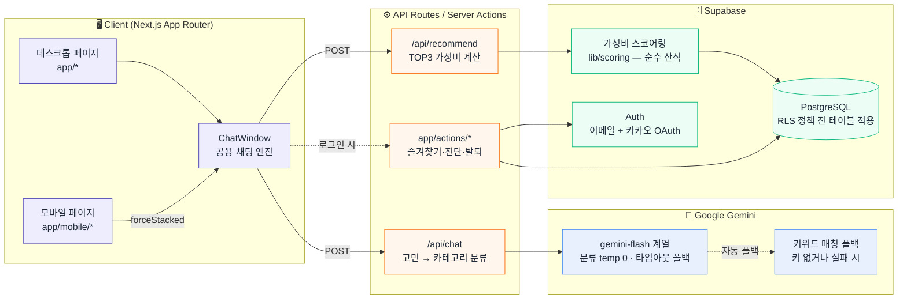
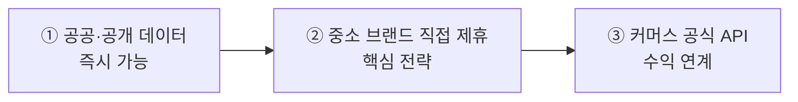

<div align="center">

# 🧪 성분핏 (IngredientFit)

### _광고 말고, 성분으로 고르세요_

전성분 **배치 순서**와 가격을 분석해 가성비 좋은 세럼을 추천하는 **AI 큐레이션 서비스**

[](#) [](#) [](#) [](#) [](#)

</div>

> 화장품은 "성분이 있냐 없냐"가 아니라 "얼마나 앞쪽에, 얼마나 진하게 들어있냐"로 효과가 갈립니다. **AI는 점수를 계산하지 않습니다** — 가성비 점수는 100% 순수 산식이 계산하고, AI는 자연어를 분류하고 그 결과를 설명하는 역할만 맡습니다. 광고 문구가 아니라 숫자로 가성비를 보여주는 게 목표입니다.

## 프로젝트 개요

성분핏은 사용자가 채팅으로 피부 고민을 말하면 AI가 핵심 성분을 분류하고, 자체 스코어링 알고리즘으로 세럼 TOP 3를 추천해주는 서비스입니다. **전성분 표기 순서(placement)** · **ml당 가격** · **예산 적합도**를 가중치를 둬서 합산한 점수로 제품을 줄 세우는 게 핵심 설계 방향이고, 이 계산 과정 전체를 사용자에게 그대로 공개합니다 — "가성비 계산법 보기" 버튼 하나로 실제 계산값을 막대그래프로 확인할 수 있어요.

원래 문제집형이었던 피부 타입 진단은 실제 피부과 자가진단 기준(세안 후 30분~1시간 방치 후 유분/당김 관찰, T존 vs U존 비교 등)에 맞춰 문항을 다듬고, 한 문항씩 선택 즉시 넘어가는 플래시게임형 UI로 다시 설계했습니다. 로그인·마이페이지·즐겨찾기·회원 탈퇴까지 인증이 필요한 기능 전체를 새로 붙이면서, "로그인 전에도 쓸 수 있어야 하지만, 로그인하면 계정에 안전하게 이어져야 한다"는 요구사항을 로컬-계정 동기화 구조로 풀었습니다.

## 주요 기능

<table>
<tr>
<td width="50%" valign="top">

### 💬 AI 채팅 추천
고민 입력 → 성분 추천 → 예산 설정 → **TOP3 결과**.
카테고리 칩 또는 자유 텍스트("눈가 주름이 고민이에요")
모두 지원, "2만원대" 같은 자유 예산 입력도 자동 파싱.

</td>
<td width="50%" valign="top">

### 🧴 피부타입 맞춤 진단
플래시게임형 4문항으로 피부타입(지성/건성/복합·민감도) 진단.
저장하면 채팅 추천에서 **내 피부에 맞춰 성분 순서를 재정렬**
(안전장치 → 피부타입 순서보다 항상 우선).

</td>
</tr>
<tr>
<td valign="top">

### 🧮 계산법 투명 공개
"가성비 계산법 보기" 버튼 하나로 공식 + 실제 계산값
(배치/가격/예산 점수)을 막대그래프 애니메이션으로 공개.
**블랙박스 없는 추천**이 핵심 차별점.

</td>
<td valign="top">

### 📸 결과 저장/공유
추천 카드를 `html-to-image`로 PNG 캡처.
모바일은 Web Share API 공유 시트, 데스크톱은 다운로드.

</td>
</tr>
<tr>
<td valign="top">

### 🔍 제품 탐색 · 상세
채팅 없이도 검색·필터(고민/성분)·정렬(가격/ml당/용량)로
열람. 카드·상세 모달 어디서든 즐겨찾기 토글 가능,
없는 제품은 "추가 요청하기" 폼으로 접수.

</td>
<td valign="top">

### ⚖️ 비교함 · ⭐ 즐겨찾기
최대 4개 제품 나란히 비교(카테고리 넘나들며 유지).
즐겨찾기는 **비로그인 시 로컬 저장 → 로그인 시 계정 자동 동기화**,
채팅/검색/상세 어디서 담아도 마이페이지에서 통합 조회.

</td>
</tr>
<tr>
<td valign="top">

### 👤 계정 · 마이페이지
이메일+비밀번호, 카카오 OAuth 로그인. 프로필(닉네임)·
피부 타입·즐겨찾기·추천 히스토리를 한 곳에서 관리,
회원 탈퇴까지 지원.

</td>
<td valign="top">

### 📱 모바일 전용 UX
탭 확장형 성분 카드, 스와이프 캐러셀 TOP3,
플로팅 액션 버튼 — 데스크톱 축소판이 아니라
터치 환경에 맞게 별도 라우트로 재설계.

</td>
</tr>
</table>

## 아키텍처



**핵심 설계 — AI는 계산하지 않습니다.** 가성비 점수는 100% 순수 산식(`lib/scoring/calculator.ts`)이 계산하고, AI는 ① 자연어 → 카테고리 분류, ② 계산된 점수를 문장으로 설명, 두 가지만 담당합니다. "그냥 GPT 쓰면 되지 않나?"에 대한 답: GPT는 실제 전성분 배치를 모르니 환각을 냅니다. 성분핏은 **전성분 데이터 기반 계산 엔진 + 자연어 인터페이스**입니다.

## 가성비 점수 계산

```
최종 점수 = (전성분 배치 점수 × 0.60) + (ml당 가격 점수 × 0.30) + (예산 점수 × 0.10)
```

### 전성분 기재 순서의 법적 한계와 보정 장치

> **한계를 먼저 명시합니다.** 화장품법 시행규칙상 **함량 1% 이하 성분·착향제·착색제는 순서와 무관하게 기재**할 수 있습니다. 이 서비스의 핵심 성분 대부분이 바로 이 구간에 있습니다 — 레티놀 통상 0.01~0.3%, 아데노신 기능성 고시 함량 0.04%, 펩타이드류 극미량.

이를 보정하는 장치가 **성분별 기준위치(refPosition)** 입니다:

| 방식 | 평가 기준 | 문제점/장점 |
|---|---|---|
| ❌ 절대 순번 | "몇 번째에 있나" | 1% 이하 구간에서 왜곡 |
| ✅ 상대 배수 | **실제 위치 ÷ 성분별 기준위치** | 성분마다 유효 함량일 때의 통상 위치 기준 (레티놀 12, 아데노신 15, 나이아신아마이드 7…) |

같은 15번째 순번이라도 아데노신이면 기준 안(만점), 나이아신아마이드면 기준의 2배(감점) — "이 성분치고는 앞/뒤에 있다"는 성분 내 상대 비교라 절대 순번의 왜곡을 상당 부분 흡수합니다. 남는 한계(정확한 함량 추정 불가)는 향후 기능성 고시 함량 공개 정보로 기준위치를 지속 보정할 계획입니다.

## AI 역할과 일관성 검증

**점수에 영향을 주는 단계는 결정론적으로 고정했습니다.**

| 단계 | temperature | 역할 |
|---|---|---|
| 고민 → 카테고리 분류 | **0 (고정)** | 추천 결과를 좌우 — 재현성 필수 |
| 인사말 생성 | 0.5 | 문장 표현만, 점수 무관 |
| 추천 이유 생성 | 0.4 | 계산된 점수를 문장으로 설명만 |

```bash
npm run dev          # 별도 터미널에서 서버 실행
npm run consistency  # 검증 스크립트 실행
```

동일 입력을 여러 번 반복 호출해 카테고리 **분류 일치율**과 응답 분포를 측정합니다. 명확한 문장은 일치율 100%를, 모호한 문장은 임의 분류 대신 되물음/미지원으로 일관 처리되는지를 통과 기준으로 둡니다.

## 학술적 근거

| 성분핏 기능 | 근거 | 개념 |
|---|---|---|
| 피부타입 설문 | Gao 2021 (대화형 추천 서베이) | Question-based Preference Elicitation |
| 신규 사용자 대응 | Gao 2021 | Cold-start |
| 프로필을 추천 피처로 | Lin 2023 (LLM×추천 서베이) | User-level Feature Augmentation (KAR/CUP) |
| **refPosition 배치 점수** | **CPDat 2018 (EPA 성분 DB)** | 퍼스널케어 함량 내림차순 기재 의무 → 순서로 함량 예측 |
| AI는 분류·설명만 | Lin 2023 | LLM as Feature Engineering (환각 회피) |

> 💡 성분핏이 "전성분 기재 순서로 함량을 추정"하는 접근은 EPA 연구진이 CPDat에서 실제로 쓴 방법과 같습니다 — 퍼스널케어 제품은 법적으로 함량 내림차순 기재 의무가 있어, 기재 순서에 모델을 적용해 함량을 예측했다는 방법론에 근거합니다.

## 데이터 확보 전략 (로드맵)

> **원칙: 크롤링 배제.** 올리브영·쿠팡은 약관상 크롤링 금지 조항(법적 리스크), 화해는 API 미공개. 현재 제품 카탈로그는 이 원칙 아래 구성한 예시 데이터입니다.



| 단계 | 경로 | 내용 |
|---|---|---|
| ① | 식약처 의약품안전나라 | 기능성화장품 심사·보고 정보 |
| | 대한화장품협회 성분사전 | 성분 표준명·표기 기준 |
| ② | D2C 인디 세럼 브랜드 | 성분을 셀링포인트로 내세우는 신생 브랜드와 데이터 제휴 |
| ③ | 이커머스 오픈 API | 약관 위반 없는 공식 API + 구매 전환 시 제휴 수익 연계 |

## 보안

| 항목 | 구현 |
|---|---|
| 🛡️ Row Level Security | 전 테이블 RLS — 카탈로그는 읽기 전용 공개, 사용자별 데이터(즐겨찾기·프로필 등)는 `auth.uid() = user_id`로 본인만 |
| 🔑 인증 | 이메일/비밀번호 + 카카오 OAuth(PKCE), 서버/브라우저 Supabase 클라이언트 분리 |
| 🗑️ 관리자 권한 격리 | 회원 탈퇴처럼 RLS 밖의 작업만 `service_role` 키를 쓰는 별도 서버 전용 클라이언트로 분리, 절대 클라이언트에 노출 안 함 |
| 🧷 로컬-계정 데이터 오염 방지 | 로그아웃 후 다른 계정으로 로그인해도 이전 브라우저 데이터가 새 계정에 섞이지 않도록 소유권 태그로 매 진입 시 검증 |
| 🚧 레이트리밋 | AI 호출 비용 남용 방지를 위한 요청 제한 |
| ✂️ 입력 검증 | 고민 텍스트 길이 제한, 잘못된 JSON/예산값 거절 |
| ⏱️ 타임아웃 폴백 | Gemini 호출 시간 제한 초과 시 키워드 매칭으로 즉시 폴백 |
| 🧯 안전장치 | 자극 성분 순위 강등·병용 주의 경고는 AI와 무관하게 코드 레벨에서 항상 체크 |

## 개발 환경

- 언어/프레임워크: TypeScript, Next.js 16 (App Router, Turbopack), React 19
- 스타일: Tailwind CSS 4 (커스텀 CSS 변수 기반 디자인 토큰, 웹·모바일 공유)
- 백엔드/DB: Supabase (PostgreSQL, Auth, Row Level Security)
- AI: Google Gemini API (`gemini-flash` 계열, 실패 시 키워드 매칭 폴백)
- 배포: Vercel

## 배포 & 실행 방법

- 배포 사이트: https://ingredient-fit.vercel.app
- GitHub 저장소: https://github.com/segretoo/IngredientFit

```bash
git clone https://github.com/segretoo/IngredientFit.git
cd IngredientFit
npm install
```

`.env.local`에 아래 값 설정 후 실행:

```env
# AI (없으면 키워드 매칭 폴백으로 동작)
GEMINI_API_KEY=AIza...

# Supabase (인증·마이페이지·즐겨찾기 등에 필요)
NEXT_PUBLIC_SUPABASE_URL=https://<ref>.supabase.co
NEXT_PUBLIC_SUPABASE_ANON_KEY=<anon-key>
SUPABASE_SERVICE_ROLE_KEY=<service-role-key>   # 회원 탈퇴 전용, NEXT_PUBLIC_ 접두사 절대 금지

# 개발용 (선택)
MOCK_LATENCY_MS=2000    # 로딩 상태 테스트용 인위적 지연
```

```bash
npm run dev
```

http://localhost:3000 접속. Gemini 키가 없어도 키워드 매칭으로 자동 폴백해서 동작합니다.

## 프로젝트 구조

```
app/
├── actions/          # Server Actions (즐겨찾기·추천 히스토리·피부 프로필·회원 탈퇴)
├── api/
│   ├── chat/route.ts       # 고민 → 카테고리 분류
│   └── recommend/route.ts  # 성분+예산 → 가성비 TOP3
├── auth/callback/     # OAuth·비밀번호 재설정 공용 콜백
├── login/ signup/ forgot-password/ reset-password/
├── mypage/            # 프로필·피부타입·즐겨찾기·히스토리 카드 모음
├── products/ chat/ skin-profile/ faq/ notice/ terms/ contact/ event/
├── mobile/            # 위 라우트들의 모바일 전용 버전 (공통 헤더는 레이아웃에서 제공)
└── layout.tsx / globals.css

components/
├── auth/              # 로그인 폼 조각, 계정 메뉴, 카카오 버튼
├── chat/               # ChatWindow · 결과 카드 · 즐겨찾기/비교 모달
├── mypage/              # 마이페이지 카드 셸, 비밀번호 변경/탈퇴 모달
├── mobile/               # 모바일 헤더·드로어
└── product/               # 제품 카드, 상세 모달

lib/
├── auth/getUser.ts        # 서버 컴포넌트용 세션 조회 헬퍼
├── supabase/                # client / server / admin(service_role) 클라이언트 분리
├── scoring/calculator.ts     # 배치순서·가격·예산 가중합산 스코어링
├── gemini/                    # 분류·인사말·추천이유 생성 (temperature 분리)
├── safety.ts                   # 자극 성분·병용 주의 안전장치
├── skinProfile.ts                # 진단 문항·채점 로직
├── localOwnership.ts              # 로컬 데이터 "소유권 태그" 검증 유틸
└── use*LoginSync.ts                # 로그인 시 로컬↔계정 동기화 훅

scripts/consistency-check.mjs   # AI 분류 일관성 검증 (npm run consistency)
middleware.ts                    # User-Agent 기반 /mobile/* 리다이렉트
```

## 학습 목표 & 설명

**Q. 추천 점수는 어떻게 계산되나요?**
**전성분 배치 순서 60% + ml당 가격 30% + 예산 적합도 10%**를 가중 합산해서 순위를 매깁니다.

- 절대 순번이 아니라 "실제 위치 ÷ 성분별 기준위치"로 계산 — 1% 이하 성분은 순서 무관 표기가 가능한 법적 한계를 보정
- 절대 가격이 아니라 ml당 가격으로 환산해 용량이 다른 제품끼리도 공정하게 비교
- 사용자가 고른 예산 구간과의 근접도를 마지막 보정치로 반영

**Q. 왜 AI가 추천 점수를 직접 계산하지 않나요?**
**LLM은 실제 전성분 배치를 모르니, 점수를 직접 매기게 하면 환각(hallucination)을 냅니다.**

- 점수에 영향을 주는 "고민 → 카테고리 분류" 단계만 temperature 0으로 고정해 재현성을 확보
- 실제 점수 계산은 순수 함수(`lib/scoring/calculator.ts`)가 전담 — AI는 분류와 설명 문장 생성만 담당
- `npm run consistency`로 동일 입력의 분류 일치율을 직접 측정해 검증

**Q. 로그인 안 해도 즐겨찾기·피부 진단이 되는 이유는?**
**로컬(브라우저)을 기본값으로 두고, 로그인했을 때만 계정과 동기화**하는 구조라서입니다.

- 비로그인 상태에선 `localStorage`에만 저장 — 채팅에서 성분 우선순위 조정 등 개인화 기능은 그대로 작동
- 로그인하는 순간 로컬 값을 계정(Supabase)으로 밀어 올리는 동기화 훅이 실행됨
- 즐겨찾기는 배열이라 병합(merge)하면 되지만, 피부 타입은 "지금 내 피부" 하나뿐인 값이라 양방향 동기화(로컬↔계정 중 최신값으로 맞춤)로 다르게 처리

**Q. 로그아웃한 브라우저에 남은 데이터가 다른 계정으로 새어 들어가지 않게 어떻게 막았나요?**
**소유권 태그**로 "이 로컬 값이 지금 로그인한 사람 것이 맞는지"를 페이지에 들어올 때마다 스스로 검증합니다.

- `lib/localOwnership.ts`가 로컬 값 옆에 "누구 것인지" 태그를 같이 저장
- 태그와 현재 로그인 사용자가 다르면(로그아웃 상태거나 다른 계정) 즉시 비움
- 로그아웃 버튼 클릭 이벤트에만 의존하지 않음 — React가 한 커밋 안에서 "모든 컴포넌트 정리 → 새 컴포넌트 시작" 순서를 지키는 걸 이용해, 브라우저를 그냥 닫아도 다음 페이지 진입 때 항상 정확한 값을 읽도록 설계

**Q. RLS(Row Level Security)는 왜, 어떻게 적용했나요?**
**`auth.uid() = user_id`** 정책으로, 사용자별 데이터 접근을 애플리케이션 코드가 아니라 DB 레벨에서 강제합니다.

- anon key가 브라우저에 노출돼도 안전한 이유가 이 정책 — 실제 보안은 RLS가 담당
- Supabase SQL Editor는 superuser 권한이라 정책을 우회함 — 실제 검증은 anon key로 직접 API를 호출해봐야 함
- 원본 SQL로 새 테이블을 만들면 `NOTIFY pgrst, 'reload schema'`를 실행하지 않는 한 API에 테이블이 안 잡힘

**Q. 데스크톱과 모바일을 왜 별도 라우트(`/mobile/*`)로 나눴나요?**
**미들웨어에서 User-Agent를 감지해 서버 단에서 리다이렉트**하는 구조를 택했습니다.

- 콘텐츠 컴포넌트(폼, 카드 등)는 Header/Footer 없이 순수하게 두고, 데스크톱/모바일 페이지가 각자 다른 틀로 감싸는 방식으로 중복을 줄임
- 클라이언트 사이드 반응형(미디어 쿼리) 대신 서버 리다이렉트를 쓴 이유는, 모바일 전용 헤더(우측 슬라이드 메뉴)처럼 아예 다른 컴포넌트 트리가 필요했기 때문

**Q. 회원 탈퇴는 왜 일반 로그인 권한으로 처리하지 못하나요?**
**`auth.users` 자체를 지우는 건 anon key 권한 밖**이라, `service_role` 키를 쓰는 별도 관리자 클라이언트가 필요합니다.

- 지울 대상 id는 클라이언트가 넘기지 않고, 서버가 현재 로그인 세션에서 직접 확인 — 임의로 남의 계정을 지우는 요청을 막기 위함
- 연결된 즐겨찾기·피부 프로필·추천 히스토리는 `on delete cascade`로 DB가 자동 정리 — 테이블마다 따로 지우는 코드 없음

## 설계 Trade-off

**로컬 우선 vs 서버 우선 저장** — 즐겨찾기·피부 진단을 처음부터 계정 필수로 만들면 데이터 정합성 관리가 훨씬 단순해지지만, 로그인 장벽 때문에 비로그인 사용자가 개인화 기능을 아예 못 쓰게 됩니다. 로컬을 기본값으로 두고 로그인 시에만 동기화하는 쪽을 택했고, 그 대가로 "소유권 태그" 같은 별도 안전장치를 만들어야 했습니다.

**anon key + RLS vs 서버에서 매번 권한 체크** — 모든 쿼리를 API 라우트에서 수동으로 권한 검증하는 대신, RLS 정책을 DB에 선언해두는 쪽을 택했습니다. 쿼리 코드가 훨씬 단순해지지만, "SQL Editor에서 잘 되는 것"과 "실제 anon 권한으로 잘 되는 것"이 다르다는 걸 트러블슈팅 과정에서 직접 겪었습니다.

**크롤링 대신 공개 데이터 + 제휴 로드맵** — 가장 빠른 데이터 확보 방법은 크롤링이지만 주요 플랫폼 약관 위반 리스크가 있어 배제했습니다. 대신 공공 데이터로 시작해서 중소 브랜드 제휴, 이후 공식 API 연동으로 단계적으로 넓혀가는 방향으로 설계했고, 그 결과 지금 카탈로그는 실제 제휴 데이터가 아닌 예시 데이터로 구성돼 있습니다.

## 배운 것 & 마무리

> 이 프로젝트를 통해 답할 수 있게 된 질문: **"AI가 신뢰할 수 없는 계산을 대신하지 않게 하면서, 로그인 전/후 상태가 자유롭게 오가는 서비스에서 사용자 데이터를 안전하고 매끄럽게 이어주려면 어떻게 설계해야 하는가?"**

**추천 시스템** — 순수 함수 기반 스코어링과 LLM 분류의 역할 분리, 법적 표기 한계를 보정하는 도메인 지식 반영 · **Next.js App Router** — Server/Client Component 분리, Server Actions, 미들웨어 기반 리다이렉트 · **Supabase** — RLS 정책 설계, OAuth(카카오)+이메일 인증, service_role 관리자 클라이언트 분리 · **상태 동기화** — 로컬-계정 양방향 동기화, 소유권 검증 패턴 · **React** — `useSyncExternalStore` 기반 커스텀 훅, effect 실행 순서를 이용한 안전장치 설계

## 참고 / 트러블슈팅

- **RLS 무응답 함정**: 정책이 없는 테이블은 anon 권한으로 조회 시 에러 없이 그냥 빈 배열만 돌아옴 — "에러가 없으니 괜찮겠지"로 넘어가면 놓치기 쉬움. Supabase SQL Editor는 superuser라 이 문제를 재현조차 못 하므로, 반드시 실제 anon key로 API를 직접 호출해서 검증해야 함
- **PostgREST 스키마 캐시**: 원본 SQL로 테이블을 만들면 `NOTIFY pgrst, 'reload schema'`를 실행하기 전까지 API가 그 테이블의 존재 자체를 모름
- **`npm run dev`와 `npm run build`의 타입 체크 차이**: dev 모드는 엄격한 타입 검사를 건너뛰어서, 실제 타입 에러가 배포 직전 빌드에서야 드러나는 경우가 있음 — 습관적으로 빌드를 미리 돌려보는 게 안전
- **뷰포트 설정 누락**: `app/layout.tsx`에 `viewport` export가 없으면 실제 모바일 기기에서 약 980px 가상 너비로 렌더링된 뒤 축소되는 현상이 생김. 브라우저 개발자도구의 모바일 에뮬레이션은 이 문제를 자동으로 보정해서 보여주기 때문에 실기기로 직접 확인하기 전까진 발견하기 어려움
- **Gemini 응답 잘림**: `maxOutputTokens`를 너무 낮게 잡으면 안전 안내 문구가 문장 중간에 잘림 — 한도를 올리고 `finishReason === "MAX_TOKENS"` 감지 로직을 같이 넣어 대응
- **Vercel Hobby 플랜 제약**: GitHub organization 소속의 private 저장소는 Hobby 플랜에서 배포 대상으로 선택할 수 없음 — 개인 계정 저장소로 옮긴 뒤 해결
- **`.env.local` 커밋 금지**: Gemini/Supabase 키가 노출되면 즉시 재발급. `service_role` 키는 특히 `NEXT_PUBLIC_` 접두사가 절대 붙으면 안 됨
- **더미 제품 데이터 주의**: 카탈로그는 크롤링 없이 구성한 예시 데이터라, `actualPosition` 등 값은 실제 제품 재입력 전까지 프로토타입 예시값으로 취급해야 함
- **의료 면책**: 서비스 결과는 의료 진단이 아니며, 채팅 진입 시 면책 동의 모달을 거침
